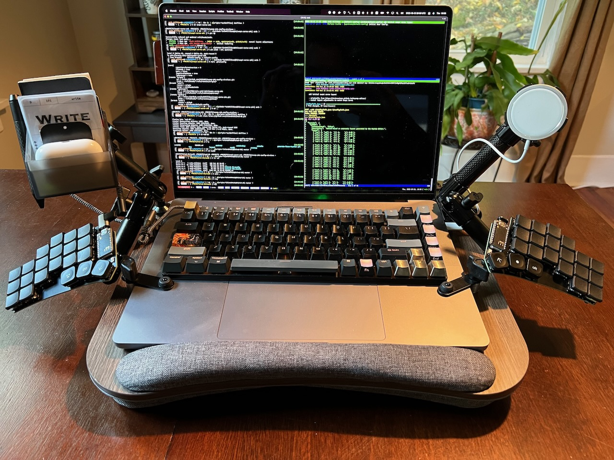
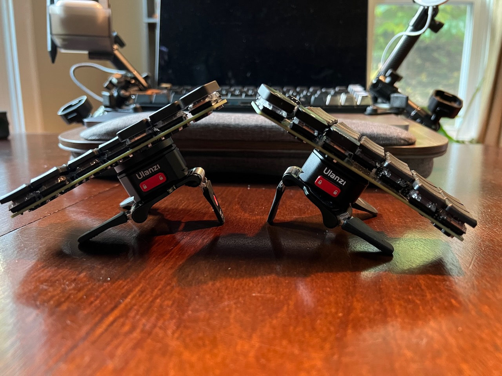
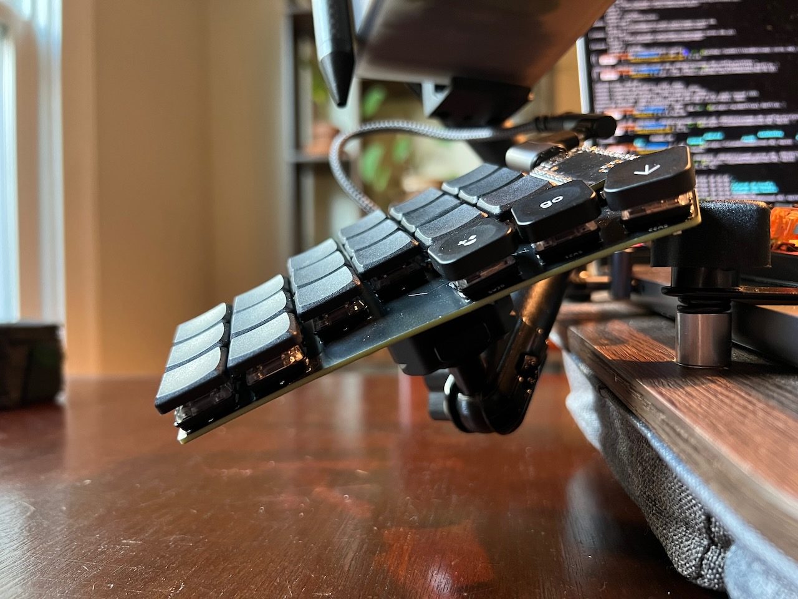
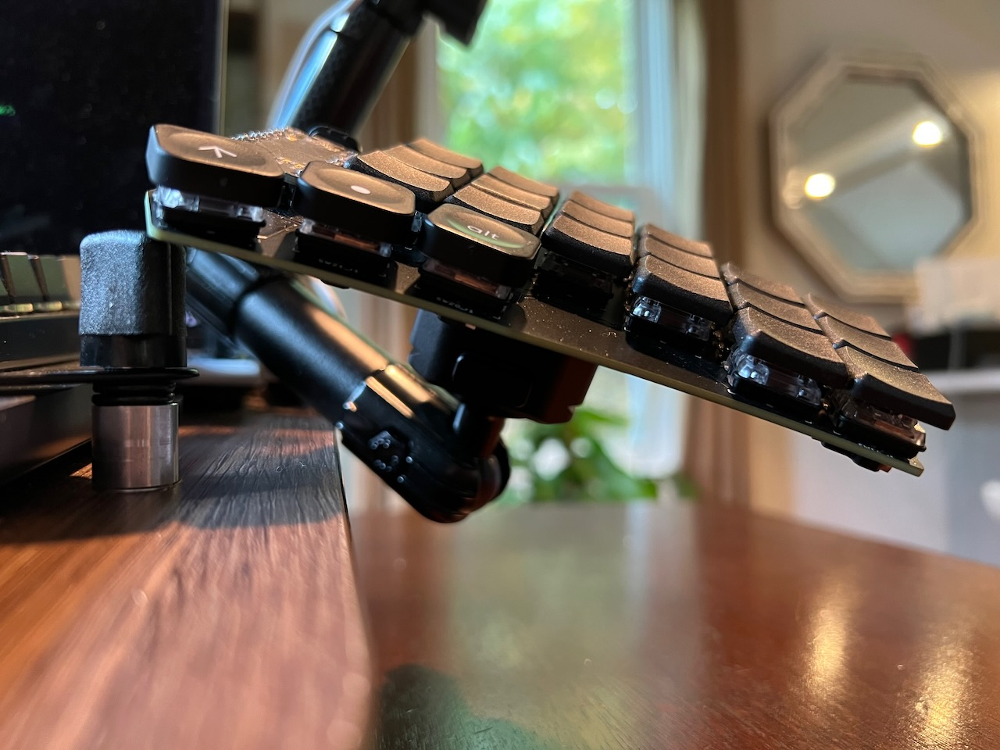
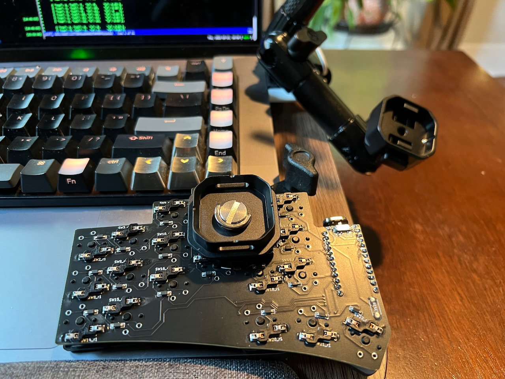
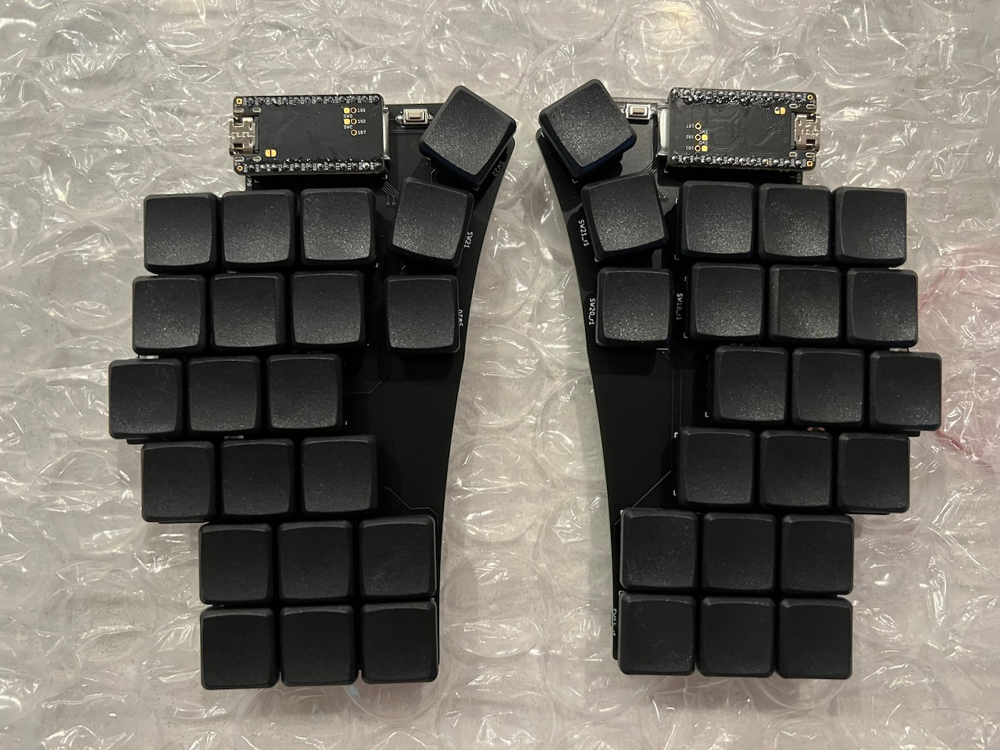
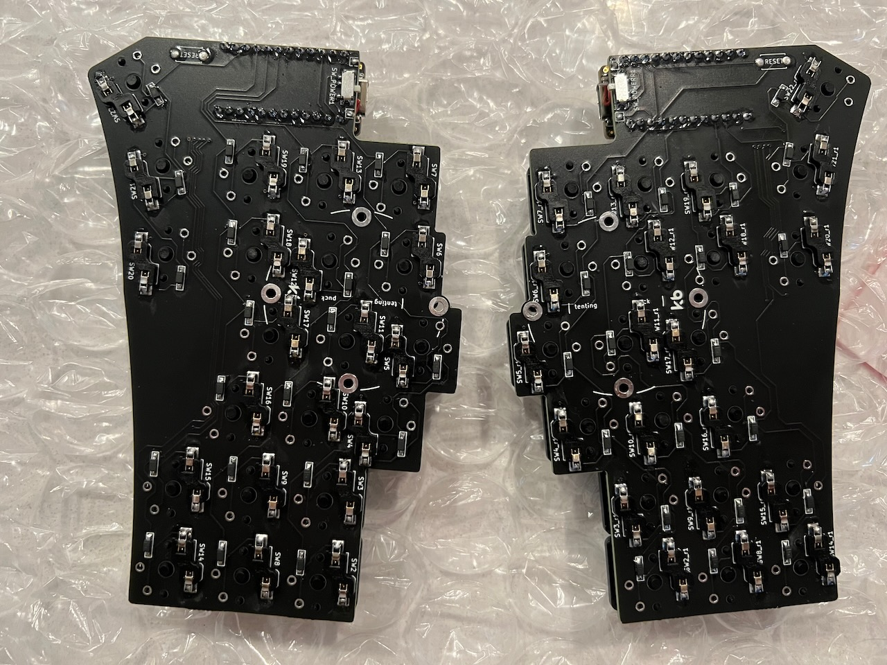

## Swept Corne Keyboard

Notes on my Swept Corne keyboard designed and custom built by Mariano Uvalle (a.k.a. [MechaCatErgo](https://www.etsy.com/shop/MechaCatErgo?ref=simple-shop-header-name&listing_id=1235225784)).

### Tenting
Fitted with splitkb.com [tenting pucks](https://splitkb.com/collections/keyboard-parts/products/tenting-puck?variant=33156011720781) which I had originally mounted on [Manfrotto pocket tripods](https://splitkb.com/collections/keyboard-parts/products/manfrotto-pocket-tripod?variant=39254223814733) based on Mariano's notes. It took a bit of experimentation to find a configuration of the tripods that didn't result in the board tipping in one direction or another while I was typing. In the best configuration I could find, there was still a slight bit of tip when I hit the top-most keys closest to the USB ports (position SW7), but I'm probably using more force than necessary for that keystroke.

All of that is effectively a moot point for me now anyway, though, since I wound up getting some [quick release plates](https://www.amazon.com/gp/product/B08L7GV7KW) and using those to clip the board halves into [arms](https://www.tackform.com/products/4-75-stud-arm-dual-20mm-ball-couplers-enduro-series) on my custom-modified [lap desk](https://www.amazon.com/gp/product/B097JKLBQM). I got an extra set of quick release bases for the Manfrotto tripods as well, and the extra added height of the quick release mechanism now allows for a non-tipping configuration.

### Switches
Based on my limited use, I am going to swap out the Kailh Brown Choc switches for ones that require less force. 60gf feels way too heavy to me; I can see why Mariano prefers the 20gf Kailh Pink Choc switches. But I really want that tactile bump, so I'm going to try out the 40gf [Kailh Sunset switches](https://lowprokb.ca/collections/keyboards/products/sunset-tactile-choc-switches), which were the lightest tactile Choc switches I could find.

### Keycaps
The stock MBK Low Profile PBT Choc blank keycaps are more slippery than I am accustomed to, so that will be another adjustment. I've got another set of Choc-spaced PBT keycaps on order to try out. lowprokb.ca has an [LDSA profile](https://lowprokb.ca/products/ldsa-low-profile-blank-keycaps) design in the works that looks pretty interesting, too. Maybe the lighter switches will help with the slipperiness issue, too. Otherwise, I might have to take a sander to the blanks to roughen them up a bit.

### Design
The column stagger Mariano wound up with for the Swept seems just perfect. My hands naturally curl to fit the profile perfectly. It's interesting how awkward it is to reach some of the far-column pinky-keys. I wonder if this might be why those keys on standard keyboards are traditionally wider. I'm still adjusting to the ortholinear layout; I suspect that is going to take a while to get used to.

I'm a little worried about breaking or wearing out the tiny power switches. They are soldered on, and seem delicate.

I love the clean look of the matte black PCB and neatly laid-out traces. And Mariano's soldering is impeccable.

### Keymap
I've already created my own minor tweak to the default keymap and flashed it successfully. I'm looking forward to doing more extensive changes to this once I have some time to plan it all out. I created a [layout file](https://github.com/SethMilliken/swept-corne-zmk/commit/4391766dd7c55ff8846aeb68d2fd498992116cb3) for Nick Coutsos's nice [keymap visualization and configuration tool](https://nickcoutsos.github.io/keymap-editor/).

### Other
To reduce strain on the USB-C ports, I got a couple of [magnetic adapters](https://www.amazon.com/gp/product/B09LYX43SP). This also makes it very convenient to pop the cable on for charging and remove it when it's done.

